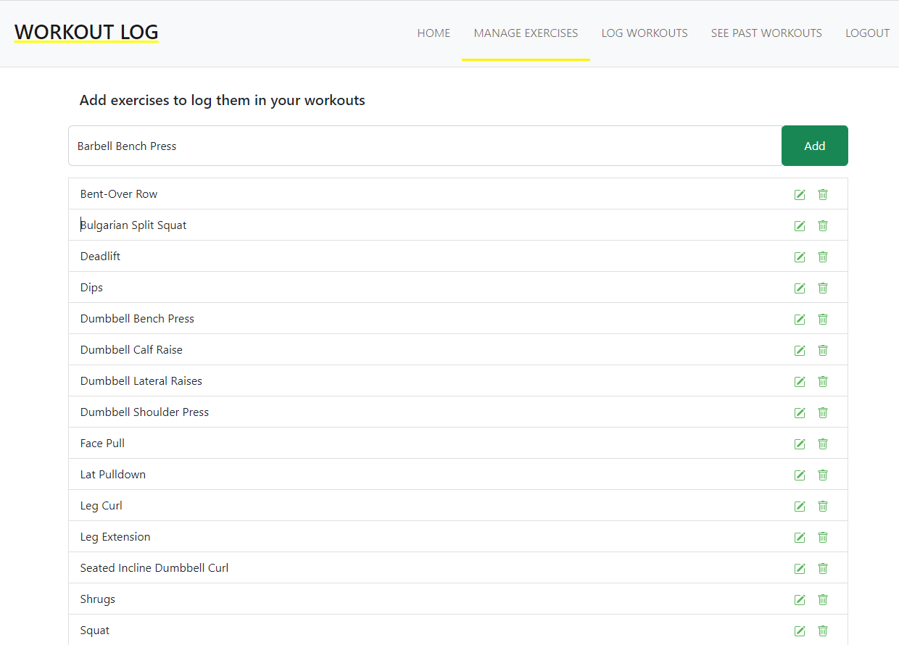
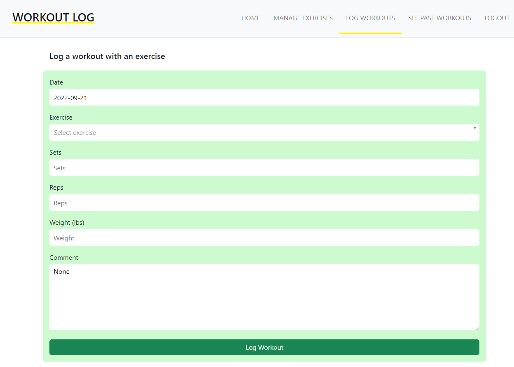
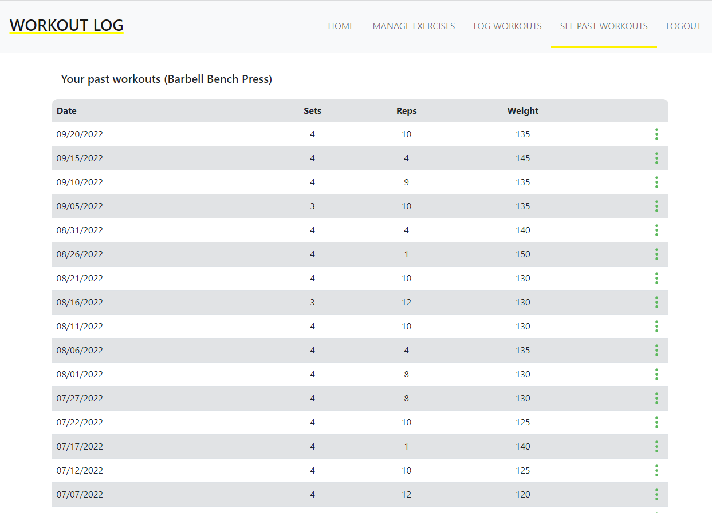

# WorkoutLog
A workout logging and tracking web application created with the Python-based web framework [Django](https://www.djangoproject.com/). Django follows the [MVT](https://www.geeksforgeeks.org/django-project-mvt-structure/) architecture. 

### Link
https://takumixd.pythonanywhere.com/

### Screenshots
#### MANAGE EXERCISES

#### LOG WORKOUTS

#### SEE PAST WORKOUTS

### Features
 - Register / Login / Logout
 - Add, delete, and rename exercises
 - Log workouts using added exercises
 - Delete and edit past workouts
 - See past workouts with a table by exercise name, newesest, and oldest 
 
### Todos
 - Remove code that was originally used for Heroku deployment
 - Fix issues with ``python manage.py collectstatic`` which is caused by previous
 - Forgot Password feature
 - Graphs to display progress of workouts
 - Calendars to see past workouts easier
 - Friends (see workouts of other users)

### Main Sources, Libraries, and Dependencies
 - [Python](https://www.python.org/), [HTML](https://html.spec.whatwg.org/multipage/), [CSS](https://www.w3.org/Style/CSS/Overview.en.html), [Javascript](https://www.javascript.com/)
 - [Bootstrap](https://getbootstrap.com/docs/5.0/getting-started/introduction/) for design templates and interface components
 - [django-crispy-forms](https://django-crispy-forms.readthedocs.io/en/latest/) to improve form layouts
 - [jQuery](https://jquery.com/) - [AJAX](https://www.w3schools.com/xml/ajax_intro.asp) to load past workouts in smaller data at a time and to use [select2](https://select2.org/) so that the user can efficiently select an exercise in the 'LOG WORKOUTS' page. 
 - [SQLite](https://www.sqlite.org/index.html) to store Users, user exercises, and user workouts in a database
 
 
 
 
